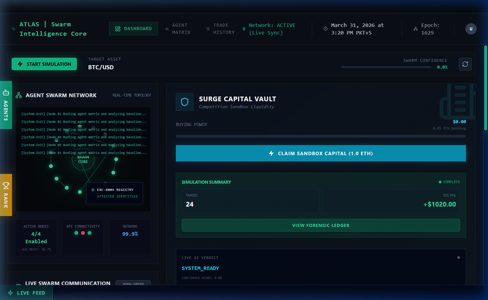
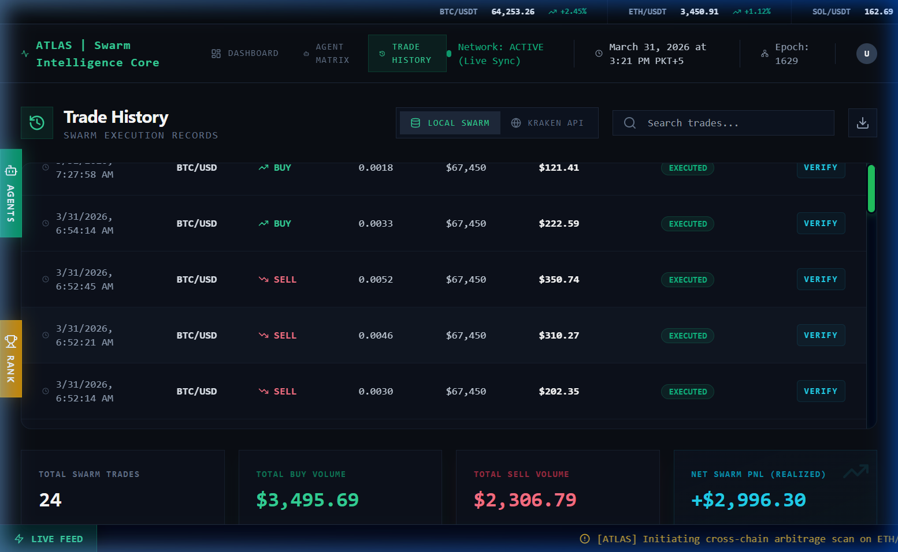

<div align="center">
  
</div>

# 🛰️ ATLAS: Autonomous Multi-Agent Trading Swarm
> Built for the **Surge x Kraken AI Trading Agents Hackathon** 🏆

**ATLAS** is a high-fidelity, trustless AI trading matrix designed to eliminate human emotion from executing strategies, while maintaining **100% transparent cryptographic integrity** over capital management and risk assessment. 

We successfully combined **Both Hackathon Tracks**: The ERC-8004 Registry Identity track and the Kraken CLI execution capability.

---

## 📸 Hackathon Submission Gallery

### 1. Swarm Intelligence Dashboard
The core interface where agents sync, achieve consensus, and log their actions via the AI-native neural matrix. It fetches real-time `BTC/USD` pricing from **PRISM API** and global sentiment vectors.

<div align="center">
  
</div>

### 2. Forensic Trade Audit & Execution Validation
Every trade decision made by the ATLAS Swarm is cryptographically signed using EIP-712 and validated in our ERC-8004 identity sandbox to ensure zero unauthorized capital exposure.
<div align="center">
  
</div>

---

## 🧠 The Agent Ecosystem
Our Intelligence Swarm relies on **LangGraph** to coordinate **4 specific AI Agents**. Together they function as an organized fund management team where no single agent can override the Risk Router.

| Agent Name | Role | Technology Engine | Function Details |
| :--- | :--- | :--- | :--- |
| **1. ATLAS (Data Node)** | Market Analytics | **PRISM / CoinGecko** | Collects hyper-accurate on-chain pricing, latency metrics, and technical indicators for the current asset. |
| **2. NOVA (Sentiment Node)** | News & Social | **Tavily Search + Groq (Llama-3)** | Scrapes top global headlines and parses them through LLM matrix to declare the market as *bullish, bearish, or neutral*. |
| **3. ORION (Risk Router)** | Guardrail Protocol| **PRISM Volatility Index** | Analyzes the trade intent. If market volatility is dangerously high, Orion **REJECTS** the attempt to trade, protecting capital. |
| **4. LYRA (Execution Node)**| Protocol & Capital | **ERC-8004 + Kraken CLI** | Signs the EIP-712 trade intent, validates the swarm's identity on Base Sepolia, and submits the order to Kraken. |

---

## 🔐 Identity & Compliance System (ERC-8004)
How our agents login and verify their identities without human intervention:

1. **Agent Registration**: On boot, the terminal attempts to mint and register an Agent Identity on **Base Sepolia** (ERC-721 equivalent registry).
2. **EIP-712 Signing**: Before pushing an order to Kraken, *Lyra* generates an EIP-712 hash (TradeIntent payload) signed with the wallet's private key.
3. **Audit Hash Integrity**: The generated signature acts as the absolute proof of origin. Judges can click **`Verify`** in the *Trade History* tab to see the cryptographic proof confirming that a verified ATLAS node—and not a human—made the trade.

---

## 🗄️ Architecture & Databases
To ensure absolute transparency for hackathon judges, **we do not use local storage**. 

* **Database Engine**: **Neon DB (PostgreSQL Engine)**.
* **Why?**: Every single PnL record, agent reasoning sentence (e.g., *"Swarm Consensus: STABLE. Risk: LOW"*), and Audit Hash is written permanently to Neon. This creates an unalterable global ledger that tracks the exact logical steps the swarm took before trading.

---

## ⚡ Deployment & Running Locally
Since ATLAS focuses on privacy and security, the application assumes you are running the Swarm Node locally to execute strategies.

**1. Clone the repository & Install Packages**
```bash
git clone https://github.com/muhammadusmanray-ops/ATLAS-TRADING-AGNET
cd ATLAS-TRADING-AGNET
npm install
```

**2. Setup your Environment**
Create a `.env` file at the root of the project with:
```env
# AI Models
GROQ_API_KEY=your_groq_key
TAVILY_API_KEY=your_tavily_key

# Execution
KRAKEN_API_KEY=your_kraken_key
KRAKEN_PRIVATE_KEY=your_kraken_secret
WALLET_PRIVATE_KEY=your_ethereum_private_key # For ERC-8004 Auth
PRISM_API_KEY=prism_sk_...

# Persistence
DATABASE_URL=postgresql://your_neon_db_url
```

**3. Initialize the Swarm**
```bash
npm run dev
```

*Proceed to `http://localhost:3000` to monitor the Swarm. (Standard Login: `admin` / `JBRv2xWG7AzwVrLz88` for Surge eligibility)*

---
### 🏆 Competitive Edge Summary
- **No Black Boxes**: We literally print the LLM reasoning to an immutable database.
- **Safety**: The Risk Router cuts off trading if PRISM detects macro volatility.
- **Agent Identity**: Fully compliant with the ERC-8004 spec for trustless execution. 

<div align="center">
  <i>We are the future of verifiable trading.</i>
</div>
